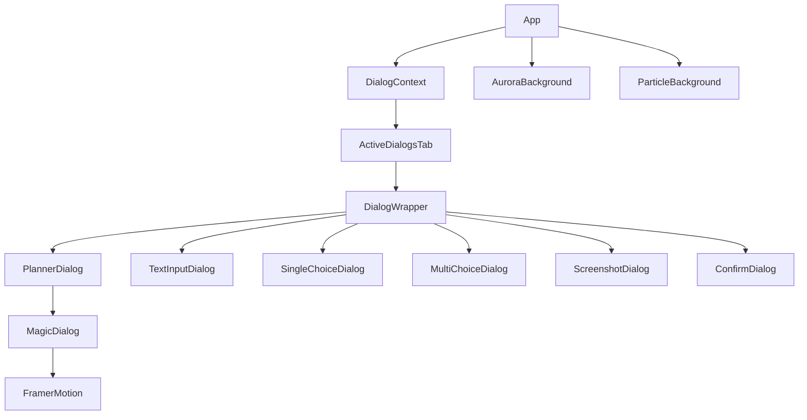

# Claude Pause Components Documentation

## Component Categories

### 1. Dialog Components (`src/renderer/components/dialogs/`)

#### PlannerDialogSimple.tsx
**Purpose**: Main dialog for decision-making with plan display
**Features**:
- 2x2 grid layout (Plan, Details, Options, Input)
- Thinking mode selector (Quick/Normal/Deep/Ultra)
- Markdown rendering for visual output
- Auto-submit on option selection
- File attachment button

**Props**:
```typescript
interface Props {
  requestId: string;
  parameters: PlannerParameters;
}
```

**Layout**:
```
┌─────────────┬─────────────┐
│ 📋 Plan     │ 📝 Details  │
├─────────────┼─────────────┤
│ Options     │ Text Input  │
└─────────────┴─────────────┘
```

#### TextInputDialog.tsx
**Purpose**: Collect free-form text input from users
**Features**:
- Auto-resizing textarea
- Character count display
- Code input mode
- Validation support

#### SingleChoiceDialog.tsx
**Purpose**: Present mutually exclusive options
**Features**:
- Radio button interface
- Keyboard shortcuts (number keys)
- Option descriptions
- Disabled state support

#### MultiChoiceDialog.tsx
**Purpose**: Allow multiple selections
**Features**:
- Checkbox interface
- Min/max selection constraints
- Select all/clear all
- Group categorization
- Tag support

#### ScreenshotDialog.tsx
**Purpose**: Request and collect screenshots
**Features**:
- Drag & drop support
- Clipboard paste (Win+Shift+S)
- Multiple image support
- Image preview grid
- Base64 encoding

#### ConfirmDialog.tsx
**Purpose**: Yes/No confirmations
**Features**:
- Danger mode styling
- Custom button labels
- Warning messages
- Keyboard shortcuts (Y/N)

### 2. Layout Components (`src/renderer/components/layout/`)

#### Header.tsx
**Purpose**: Application title bar
**Features**:
- Draggable area for frameless window
- Window control buttons
- Gradient title animation

#### StatusBar.tsx
**Purpose**: Connection status display
**Features**:
- WebSocket connection indicator
- Active dialog count
- Animated status dot

#### TabNavigation.tsx
**Purpose**: Main navigation tabs
**Features**:
- Active Dialogs tab
- History tab
- Animated underline
- Badge notifications

#### ActiveDialogsTab.tsx
**Purpose**: Display current dialogs
**Features**:
- Dialog stack management
- Empty state illustration
- Smooth transitions

#### HistoryTab.tsx
**Purpose**: Show dialog history
**Features**:
- Chronological list
- Response preview
- Type filtering
- Clear history option

#### SettingsPanel.tsx
**Purpose**: Application settings
**Features**:
- Theme selection
- Dialog frequency control
- Preference management
- Sound notifications toggle

### 3. UI Components (`src/renderer/components/ui/`)

#### MagicDialog.tsx
**Purpose**: Base dialog container
**Features**:
- Animated gradient border
- Glass morphism background
- Particle overlay effect
- Shadow layers

**Structure**:
```jsx
<div className="magic-dialog">
  <div className="magic-dialog-border" />
  <div className="magic-dialog-bg">
    <div className="magic-dialog-particles" />
    <div className="magic-dialog-content">
      {children}
    </div>
  </div>
</div>
```

#### GlassCard.tsx
**Purpose**: Glassmorphic card component
**Features**:
- Backdrop blur
- Gradient borders
- Hover effects
- Content padding

#### MagneticButton.tsx
**Purpose**: Interactive button with magnetic effect
**Features**:
- Cursor tracking
- Smooth animations
- Ripple effect
- Multiple variants

#### AnimatedText.tsx
**Purpose**: Text with animation effects
**Features**:
- Typewriter effect
- Fade in/out
- Gradient animations
- Letter spacing

### 4. Effect Components (`src/renderer/components/effects/`)

#### ParticleBackground.tsx
**Purpose**: Interactive particle system
**Features**:
- tsParticles integration
- Mouse interactions
- Connected particles
- Performance optimized

#### AuroraBackground.tsx
**Purpose**: Animated gradient background
**Features**:
- SVG filter effects
- Multiple gradient layers
- Smooth animations
- Low CPU usage

### 5. Common Components (`src/renderer/components/common/`)

#### DialogWrapper.tsx
**Purpose**: Common wrapper for all dialogs
**Features**:
- Response handling
- Keyboard shortcuts
- Focus management
- Error boundaries

## Component Patterns

### 1. Animation Pattern
All dialogs use Framer Motion for animations:
```jsx
<motion.div
  initial={{ opacity: 0, y: 20 }}
  animate={{ opacity: 1, y: 0 }}
  exit={{ opacity: 0, y: -20 }}
  transition={{ duration: 0.3 }}
>
```

### 2. Style Pattern
Components use CSS modules with Magic UI classes:
```jsx
<div className="magic-dialog planner-dialog-magic">
  <h2 className="magic-dialog-title">Title</h2>
</div>
```

### 3. State Management Pattern
Dialog state managed through context:
```jsx
const { sendResponse, activeDialogs } = useDialogs();
```

### 4. Response Pattern
Standard response structure:
```typescript
interface DialogResponse {
  cancelled?: boolean;
  timestamp: string;
  // Type-specific fields
}
```

## Component Dependencies



## Styling Guidelines

### CSS Class Naming
- Base: `magic-[component]`
- Specific: `[component]-magic`
- States: `[component].active`
- Modifiers: `[component]-[modifier]`

### Color Usage
- Primary: Blue gradient (#60a5fa → #a78bfa)
- Success: Green (#34d399)
- Danger: Red (#ef4444)
- Warning: Orange (#f59e0b)
- Background: Dark (#0f172a → #1e293b)

### Animation Timing
- Fast: 0.2s (hover effects)
- Normal: 0.3s (transitions)
- Slow: 0.6s (page transitions)
- Very Slow: 2-8s (background effects)

## Performance Considerations

1. **Memoization**: Use React.memo for expensive renders
2. **Lazy Loading**: Dynamic imports for heavy components
3. **Animation**: GPU-accelerated transforms only
4. **Event Handlers**: Debounce/throttle where needed
5. **Virtualization**: For long lists (history)

## Accessibility Features

1. **Keyboard Navigation**: Tab order, shortcuts
2. **ARIA Labels**: Screen reader support
3. **Focus Management**: Trap focus in dialogs
4. **Color Contrast**: WCAG AA compliant
5. **Motion Reduction**: Respect prefers-reduced-motion

## Testing Approach

1. **Unit Tests**: Individual component logic
2. **Integration Tests**: Component interactions
3. **Visual Tests**: Snapshot testing
4. **E2E Tests**: Full dialog flows
5. **Accessibility Tests**: aXe testing