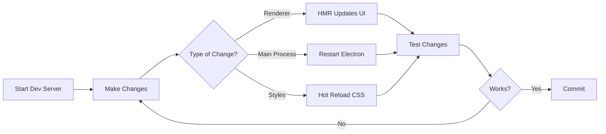

# Development Workflow Guide

## Table of Contents
1. [Environment Setup](#environment-setup)
2. [Development Process](#development-process)
3. [Code Standards](#code-standards)
4. [Component Development](#component-development)
5. [Dialog Development](#dialog-development)
6. [Debugging Techniques](#debugging-techniques)
7. [Testing Workflow](#testing-workflow)
8. [Build and Deploy](#build-and-deploy)

## Environment Setup

### Prerequisites

```bash
# Required software
node --version  # v18.0.0 or higher
npm --version   # v8.0.0 or higher
git --version   # v2.30.0 or higher

# Recommended
code --version  # VS Code
```

### Initial Setup

```bash
# Clone repository
git clone https://github.com/claude-pause/claude-pause.git
cd claude-pause/claude-pause-parent

# Install dependencies
npm install

# Setup development environment
npm run setup:dev

# This will:
# 1. Install all dependencies
# 2. Build native modules
# 3. Create .env.local file
# 4. Setup git hooks
# 5. Initialize local settings
```

### Environment Configuration

```bash
# Create .env.local file
cp .env.example .env.local

# Edit environment variables
# .env.local
NODE_ENV=development
DEBUG=true
MCP_PORT=3000
VITE_PORT=5173
ELECTRON_IS_DEV=1
ELECTRON_ENABLE_LOGGING=1
```

### VS Code Setup

```json
// .vscode/settings.json
{
  "editor.formatOnSave": true,
  "editor.codeActionsOnSave": {
    "source.fixAll.eslint": true
  },
  "typescript.tsdk": "node_modules/typescript/lib",
  "files.exclude": {
    "**/node_modules": true,
    "**/dist": true,
    "**/release": true
  },
  "search.exclude": {
    "**/node_modules": true,
    "**/dist": true,
    "**/*.log": true
  }
}
```

### Recommended Extensions

```json
// .vscode/extensions.json
{
  "recommendations": [
    "dbaeumer.vscode-eslint",
    "esbenp.prettier-vscode",
    "bradlc.vscode-tailwindcss",
    "ms-vscode.vscode-typescript-next",
    "christian-kohler.path-intellisense",
    "formulahendry.auto-rename-tag",
    "naumovs.color-highlight",
    "usernamehw.errorlens"
  ]
}
```

## Development Process

### Starting Development

```bash
# Start all development services
npm run dev

# This runs concurrently:
# 1. Vite dev server (React app) - http://localhost:5173
# 2. Electron in dev mode with hot reload
# 3. WebSocket server on port 3000
# 4. TypeScript compiler in watch mode

# Alternative: Run services separately
npm run dev:renderer  # Vite only
npm run dev:main     # Electron only
npm run dev:ws       # WebSocket only
```

### Development Workflow



### Git Workflow

```bash
# Create feature branch
git checkout -b feature/dialog-improvements

# Make changes and commit
git add .
git commit -m "feat: improve dialog animation performance"

# Push branch
git push -u origin feature/dialog-improvements

# Create pull request
gh pr create --title "Improve dialog animations" --body "..."
```

### Commit Message Convention

```
type(scope): subject

body

footer
```

Types:
- `feat`: New feature
- `fix`: Bug fix
- `docs`: Documentation
- `style`: Code style changes
- `refactor`: Code refactoring
- `perf`: Performance improvements
- `test`: Test additions/changes
- `build`: Build system changes
- `ci`: CI configuration changes
- `chore`: Other changes

Examples:
```bash
git commit -m "feat(dialog): add voice input support"
git commit -m "fix(websocket): handle reconnection properly"
git commit -m "docs: update MCP architecture diagram"
git commit -m "perf(renderer): optimize dialog rendering with memo"
```

## Code Standards

### TypeScript Guidelines

```typescript
// ✅ Good: Explicit types
interface DialogProps {
  requestId: string;
  parameters: PlannerParameters;
  onClose?: () => void;
}

// ❌ Bad: Implicit any
function processDialog(data) {
  // ...
}

// ✅ Good: Type guards
function isValidDialog(obj: unknown): obj is Dialog {
  return (
    typeof obj === 'object' &&
    obj !== null &&
    'requestId' in obj &&
    'type' in obj
  );
}

// ✅ Good: Enums for constants
enum DialogState {
  IDLE = 'idle',
  ACTIVE = 'active',
  COMPLETED = 'completed'
}

// ✅ Good: Utility types
type DialogResponse<T> = {
  success: boolean;
  data?: T;
  error?: string;
};
```

### React Best Practices

```typescript
// ✅ Good: Functional components with hooks
export function DialogComponent({ requestId, parameters }: DialogProps) {
  const [state, setState] = useState<DialogState>(initialState);
  const { sendResponse } = useDialogs();
  
  const handleSubmit = useCallback(async () => {
    // ...
  }, [dependencies]);
  
  return <div>{/* ... */}</div>;
}

// ✅ Good: Custom hooks for logic
function useDialogState(initialParams: Parameters) {
  const [state, dispatch] = useReducer(dialogReducer, {
    // initial state
  });
  
  const actions = useMemo(() => ({
    updateField: (field: string, value: any) => {
      dispatch({ type: 'UPDATE_FIELD', payload: { field, value } });
    }
  }), []);
  
  return { state, actions };
}

// ✅ Good: Error boundaries
class DialogErrorBoundary extends Component {
  componentDidCatch(error: Error, info: ErrorInfo) {
    console.error('Dialog error:', error, info);
    // Report to error tracking
  }
}

// ✅ Good: Memoization
const ExpensiveComponent = memo(({ data }) => {
  const processed = useMemo(() => processData(data), [data]);
  return <div>{processed}</div>;
});
```

### CSS/Styling Guidelines

```css
/* ✅ Good: Use CSS variables */
.dialog-container {
  background: var(--magic-bg-elevated);
  color: var(--magic-text-primary);
  padding: var(--spacing-lg);
}

/* ✅ Good: Component-scoped classes */
.planner-dialog-magic {
  /* Specific to planner dialog */
}

/* ✅ Good: Responsive design */
@media (max-width: 768px) {
  .dialog-container {
    padding: var(--spacing-sm);
  }
}

/* ❌ Bad: Overly specific selectors */
.app .main .dialog .container .content .text {
  /* Too specific */
}

/* ✅ Good: Animation performance */
.animated-element {
  will-change: transform;
  transform: translateZ(0); /* GPU acceleration */
}
```

## Component Development

### Creating a New Component

```bash
# Use component generator
npm run generate:component MyComponent

# Or manually create files:
# src/renderer/components/MyComponent/
# ├── MyComponent.tsx
# ├── MyComponent.test.tsx
# ├── MyComponent.stories.tsx
# └── index.ts
```

### Component Template

```typescript
// MyComponent.tsx
import { memo, useState, useCallback } from 'react';
import { motion } from 'framer-motion';
import './MyComponent.css';

export interface MyComponentProps {
  title: string;
  onAction?: () => void;
  className?: string;
}

export const MyComponent = memo(function MyComponent({
  title,
  onAction,
  className = ''
}: MyComponentProps) {
  const [isActive, setIsActive] = useState(false);
  
  const handleClick = useCallback(() => {
    setIsActive(prev => !prev);
    onAction?.();
  }, [onAction]);
  
  return (
    <motion.div
      className={`my-component ${className}`}
      initial={{ opacity: 0 }}
      animate={{ opacity: 1 }}
      exit={{ opacity: 0 }}
    >
      <h3>{title}</h3>
      <button onClick={handleClick}>
        {isActive ? 'Active' : 'Inactive'}
      </button>
    </motion.div>
  );
});

// index.ts
export { MyComponent } from './MyComponent';
export type { MyComponentProps } from './MyComponent';
```

### Component Testing

```typescript
// MyComponent.test.tsx
import { render, screen, fireEvent } from '@testing-library/react';
import { MyComponent } from './MyComponent';

describe('MyComponent', () => {
  it('renders title', () => {
    render(<MyComponent title="Test Title" />);
    expect(screen.getByText('Test Title')).toBeInTheDocument();
  });
  
  it('calls onAction when clicked', () => {
    const handleAction = jest.fn();
    render(<MyComponent title="Test" onAction={handleAction} />);
    
    fireEvent.click(screen.getByRole('button'));
    expect(handleAction).toHaveBeenCalledTimes(1);
  });
  
  it('toggles active state', () => {
    render(<MyComponent title="Test" />);
    const button = screen.getByRole('button');
    
    expect(button).toHaveTextContent('Inactive');
    fireEvent.click(button);
    expect(button).toHaveTextContent('Active');
  });
});
```

### Storybook Story

```typescript
// MyComponent.stories.tsx
import type { Meta, StoryObj } from '@storybook/react';
import { MyComponent } from './MyComponent';

const meta: Meta<typeof MyComponent> = {
  title: 'Components/MyComponent',
  component: MyComponent,
  parameters: {
    layout: 'centered',
  },
  tags: ['autodocs'],
  argTypes: {
    onAction: { action: 'clicked' },
  },
};

export default meta;
type Story = StoryObj<typeof meta>;

export const Default: Story = {
  args: {
    title: 'Default Component',
  },
};

export const WithLongTitle: Story = {
  args: {
    title: 'This is a very long title that might wrap to multiple lines',
  },
};

export const Interactive: Story = {
  args: {
    title: 'Click me!',
  },
  play: async ({ canvasElement }) => {
    const canvas = within(canvasElement);
    const button = canvas.getByRole('button');
    await userEvent.click(button);
  },
};
```

## Dialog Development

### Adding a New Dialog Type

1. **Define the dialog interface**:

```typescript
// src/renderer/types/index.ts
export interface MyDialogParameters {
  question: string;
  options?: string[];
  defaultValue?: string;
}

export interface MyDialogResponse extends DialogResponse {
  answer: string;
  confidence?: number;
}
```

2. **Create the dialog component**:

```typescript
// src/renderer/components/dialogs/MyDialog.tsx
export function MyDialog({ requestId, parameters }: DialogProps<MyDialogParameters>) {
  const { sendResponse } = useDialogResponse(requestId);
  const [answer, setAnswer] = useState(parameters.defaultValue || '');
  
  const handleSubmit = useCallback(async () => {
    await sendResponse({
      answer,
      confidence: 0.95,
      timestamp: new Date().toISOString()
    });
  }, [answer, sendResponse]);
  
  return (
    <MagicDialog className="my-dialog-magic">
      {/* Dialog content */}
    </MagicDialog>
  );
}
```

3. **Register in DialogWrapper**:

```typescript
// src/renderer/components/common/DialogWrapper.tsx
import { MyDialog } from '../dialogs/MyDialog';

const dialogComponents = {
  // ... existing dialogs
  'my_dialog': MyDialog
};
```

4. **Update MCP mapping**:

```javascript
// src/main/index.js
mapToolToDialogType(tool) {
  const mapping = {
    // ... existing mappings
    'my_tool': 'my_dialog'
  };
  return mapping[tool] || tool;
}
```

### Dialog Testing Strategy

```typescript
// Test utilities
export function renderDialog(
  Component: React.ComponentType<any>,
  props: any
) {
  return render(
    <DialogProvider>
      <Component {...props} />
    </DialogProvider>
  );
}

// Dialog test
describe('MyDialog', () => {
  const mockParams: MyDialogParameters = {
    question: 'Test question?',
    options: ['Option 1', 'Option 2']
  };
  
  it('renders question', () => {
    renderDialog(MyDialog, {
      requestId: 'test-1',
      parameters: mockParams
    });
    
    expect(screen.getByText('Test question?')).toBeInTheDocument();
  });
  
  it('submits response', async () => {
    const { sendResponse } = mockDialogContext();
    
    renderDialog(MyDialog, {
      requestId: 'test-1',
      parameters: mockParams
    });
    
    // Fill answer
    const input = screen.getByRole('textbox');
    await userEvent.type(input, 'My answer');
    
    // Submit
    const submitBtn = screen.getByText('Submit');
    await userEvent.click(submitBtn);
    
    expect(sendResponse).toHaveBeenCalledWith('test-1', {
      answer: 'My answer',
      confidence: 0.95,
      timestamp: expect.any(String)
    });
  });
});
```

## Debugging Techniques

### Chrome DevTools

```javascript
// Enable DevTools in development
if (process.env.NODE_ENV === 'development') {
  mainWindow.webContents.openDevTools();
}

// Debugging shortcuts
// F12 - Toggle DevTools
// Ctrl+Shift+I - Open DevTools
// Ctrl+R - Reload
// Ctrl+Shift+R - Hard reload
```

### Debug Logging

```typescript
// Create debug logger
const debug = createDebugger('dialog:planner');

export function PlannerDialog({ requestId, parameters }: Props) {
  debug('Rendering dialog', { requestId, parameters });
  
  useEffect(() => {
    debug('Dialog mounted');
    return () => debug('Dialog unmounted');
  }, []);
  
  const handleSubmit = useCallback((response: any) => {
    debug('Submitting response', response);
    // ...
  }, []);
}

// Enable specific debuggers
localStorage.setItem('DEBUG', 'dialog:*');
localStorage.setItem('DEBUG', 'websocket,ipc,dialog:planner');
```

### React DevTools

```typescript
// Add display names for debugging
MyComponent.displayName = 'MyComponent';

// Use debug values in hooks
function useMyHook() {
  const [state, setState] = useState(initialState);
  
  useDebugValue(state, state => `State: ${JSON.stringify(state)}`);
  
  return [state, setState];
}

// Track renders
function useWhyDidYouUpdate(name: string, props: Record<string, any>) {
  const previousProps = useRef<Record<string, any>>();
  
  useEffect(() => {
    if (previousProps.current) {
      const allKeys = Object.keys({ ...previousProps.current, ...props });
      const changedProps: Record<string, any> = {};
      
      allKeys.forEach(key => {
        if (previousProps.current![key] !== props[key]) {
          changedProps[key] = {
            from: previousProps.current![key],
            to: props[key]
          };
        }
      });
      
      if (Object.keys(changedProps).length) {
        console.log('[why-did-you-update]', name, changedProps);
      }
    }
    
    previousProps.current = props;
  });
}
```

### Performance Profiling

```typescript
// React Profiler
import { Profiler } from 'react';

function onRenderCallback(
  id: string,
  phase: 'mount' | 'update',
  actualDuration: number,
  baseDuration: number,
  startTime: number,
  commitTime: number,
  interactions: Set<any>
) {
  console.log(`${id} (${phase}) took ${actualDuration}ms`);
}

<Profiler id="DialogList" onRender={onRenderCallback}>
  <DialogList />
</Profiler>

// Performance marks
performance.mark('dialog-render-start');
// ... render dialog
performance.mark('dialog-render-end');
performance.measure(
  'dialog-render',
  'dialog-render-start',
  'dialog-render-end'
);

// Memory profiling
setInterval(() => {
  if (performance.memory) {
    console.log('Memory:', {
      used: Math.round(performance.memory.usedJSHeapSize / 1048576) + ' MB',
      total: Math.round(performance.memory.totalJSHeapSize / 1048576) + ' MB'
    });
  }
}, 5000);
```

### Network Debugging

```typescript
// WebSocket debugging
class DebugWebSocket extends WebSocket {
  constructor(url: string) {
    super(url);
    console.log('[WS] Connecting to', url);
    
    this.addEventListener('open', () => {
      console.log('[WS] Connected');
    });
    
    this.addEventListener('message', (event) => {
      console.log('[WS] Received:', JSON.parse(event.data));
    });
    
    this.addEventListener('error', (error) => {
      console.error('[WS] Error:', error);
    });
    
    this.addEventListener('close', (event) => {
      console.log('[WS] Closed:', event.code, event.reason);
    });
  }
  
  send(data: string | ArrayBuffer | Blob) {
    console.log('[WS] Sending:', data);
    super.send(data);
  }
}

// IPC debugging
ipcRenderer.on('*', (event, channel, ...args) => {
  console.log(`[IPC] ${channel}:`, args);
});
```

## Testing Workflow

### Running Tests

```bash
# Run all tests
npm test

# Run tests in watch mode
npm test -- --watch

# Run tests with coverage
npm test -- --coverage

# Run specific test file
npm test MyComponent.test.tsx

# Run tests matching pattern
npm test -- --testNamePattern="renders"

# Debug tests
npm test -- --inspect-brk --runInBand
```

### Test Structure

```
src/
├── __tests__/          # Global test utilities
├── components/
│   └── MyComponent/
│       ├── MyComponent.tsx
│       └── MyComponent.test.tsx
├── utils/
│   ├── validation.ts
│   └── validation.test.ts
└── setupTests.ts       # Test setup
```

### Test Utilities

```typescript
// src/__tests__/test-utils.tsx
import { render, RenderOptions } from '@testing-library/react';
import { DialogProvider } from '@/context/DialogContext';
import { SettingsProvider } from '@/context/SettingsContext';

const AllTheProviders = ({ children }: { children: React.ReactNode }) => {
  return (
    <SettingsProvider>
      <DialogProvider>
        {children}
      </DialogProvider>
    </SettingsProvider>
  );
};

const customRender = (
  ui: React.ReactElement,
  options?: Omit<RenderOptions, 'wrapper'>
) => render(ui, { wrapper: AllTheProviders, ...options });

export * from '@testing-library/react';
export { customRender as render };
```

### Mock Utilities

```typescript
// Mock Electron API
export function mockElectronAPI() {
  const api = {
    sendDialogResponse: jest.fn().mockResolvedValue({ success: true }),
    onDialogRequest: jest.fn((callback) => {
      // Return unsubscribe function
      return jest.fn();
    }),
    minimizeWindow: jest.fn(),
    maximizeWindow: jest.fn(),
    closeWindow: jest.fn(),
    getSettings: jest.fn().mockResolvedValue(defaultSettings),
    saveSettings: jest.fn().mockResolvedValue({ success: true })
  };
  
  (window as any).electronAPI = api;
  return api;
}

// Mock WebSocket
export class MockWebSocket extends EventTarget {
  static CONNECTING = 0;
  static OPEN = 1;
  static CLOSING = 2;
  static CLOSED = 3;
  
  readyState = MockWebSocket.CONNECTING;
  url: string;
  
  constructor(url: string) {
    super();
    this.url = url;
    
    setTimeout(() => {
      this.readyState = MockWebSocket.OPEN;
      this.dispatchEvent(new Event('open'));
    }, 0);
  }
  
  send(data: string) {
    // Simulate echo response
    setTimeout(() => {
      this.dispatchEvent(new MessageEvent('message', { data }));
    }, 10);
  }
  
  close() {
    this.readyState = MockWebSocket.CLOSED;
    this.dispatchEvent(new CloseEvent('close'));
  }
}
```

## Build and Deploy

### Build Process

```bash
# Development build
npm run build:dev

# Production build
npm run build

# Platform-specific builds
npm run build:win
npm run build:mac
npm run build:linux

# Build all platforms
npm run build:all
```

### Build Configuration

```javascript
// electron-builder.config.js
module.exports = {
  appId: 'ai.claude.pause',
  productName: 'Claude Pause',
  directories: {
    output: 'release',
    buildResources: 'build'
  },
  files: [
    'dist/**/*',
    'src/main/**/*',
    'public/**/*'
  ],
  mac: {
    category: 'public.app-category.developer-tools',
    hardenedRuntime: true,
    gatekeeperAssess: false,
    entitlements: 'build/entitlements.mac.plist',
    notarize: {
      teamId: process.env.APPLE_TEAM_ID
    }
  },
  win: {
    target: ['nsis', 'portable'],
    certificateFile: process.env.WIN_CERT_FILE,
    certificatePassword: process.env.WIN_CERT_PASSWORD
  },
  linux: {
    target: ['AppImage', 'deb', 'rpm'],
    category: 'Development'
  }
};
```

### Pre-build Checklist

```bash
# Run pre-build checks
npm run prebuild

# This will:
# 1. Run linter
# 2. Run type checks
# 3. Run tests
# 4. Check bundle size
# 5. Validate package.json
# 6. Clean build directories
```

### Release Process

```bash
# 1. Update version
npm version patch  # or minor/major

# 2. Build and test
npm run build
npm run test:prod

# 3. Create release
npm run release

# This will:
# - Build all platforms
# - Create installers
# - Generate checksums
# - Create release notes
# - Upload to GitHub releases

# 4. Publish
npm run publish
```

### CI/CD Pipeline

```yaml
# .github/workflows/release.yml
name: Release

on:
  push:
    tags:
      - 'v*'

jobs:
  build:
    strategy:
      matrix:
        os: [macos-latest, windows-latest, ubuntu-latest]
    
    runs-on: ${{ matrix.os }}
    
    steps:
      - uses: actions/checkout@v3
      
      - name: Setup Node.js
        uses: actions/setup-node@v3
        with:
          node-version: 18
          cache: 'npm'
      
      - name: Install dependencies
        run: npm ci
      
      - name: Run tests
        run: npm test
      
      - name: Build
        run: npm run build
        
      - name: Package
        run: npm run dist
        env:
          GH_TOKEN: ${{ secrets.GITHUB_TOKEN }}
      
      - name: Upload artifacts
        uses: actions/upload-artifact@v3
        with:
          name: ${{ matrix.os }}-build
          path: release/
```

## Troubleshooting Development Issues

### Common Issues

1. **Port already in use**:
```bash
# Kill process on port
npx kill-port 3000 5173

# Or find and kill manually
lsof -i :3000
kill -9 <PID>
```

2. **Native module issues**:
```bash
# Rebuild native modules
npm run rebuild

# Or manually
npx electron-rebuild
```

3. **TypeScript errors**:
```bash
# Clear TypeScript cache
rm -rf node_modules/.cache/typescript
npm run type-check
```

4. **Hot reload not working**:
```bash
# Clear Vite cache
rm -rf node_modules/.vite
npm run dev
```

### Debug Commands

```bash
# Verbose logging
DEBUG=* npm run dev

# Electron debugging
ELECTRON_ENABLE_LOGGING=1 npm run dev

# Node debugging
node --inspect-brk node_modules/.bin/electron .

# Memory leak detection
node --expose-gc --inspect node_modules/.bin/electron .
```

### Performance Debugging

```javascript
// Add to main process
app.commandLine.appendSwitch('enable-precise-memory-info');
app.commandLine.appendSwitch('enable-gpu-rasterization');

// Monitor performance
setInterval(() => {
  mainWindow.webContents.executeJavaScript(`
    console.table({
      'JS Heap': (performance.memory.usedJSHeapSize / 1048576).toFixed(2) + ' MB',
      'DOM Nodes': document.getElementsByTagName('*').length,
      'Event Listeners': (() => {
        let count = 0;
        const allElements = document.getElementsByTagName('*');
        for (let element of allElements) {
          const listeners = getEventListeners(element);
          for (let type in listeners) {
            count += listeners[type].length;
          }
        }
        return count;
      })()
    });
  `);
}, 10000);
```