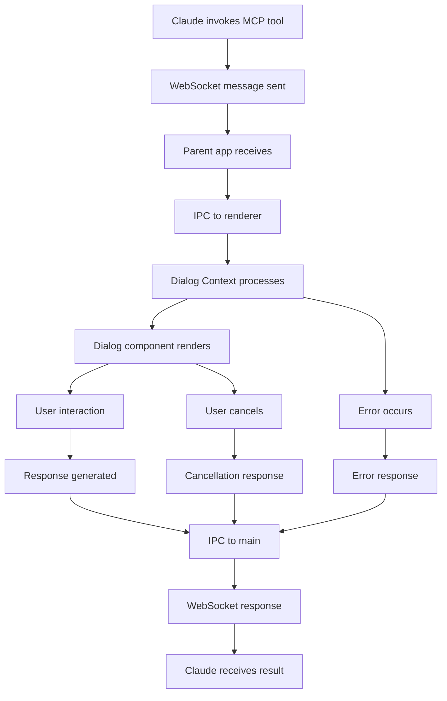

# Dialog Lifecycle and State Management

## Table of Contents
1. [Dialog Lifecycle Overview](#dialog-lifecycle-overview)
2. [State Management Architecture](#state-management-architecture)
3. [Dialog Context Implementation](#dialog-context-implementation)
4. [Dialog Types Deep Dive](#dialog-types-deep-dive)
5. [Response Handling](#response-handling)
6. [Error States and Recovery](#error-states-and-recovery)
7. [Performance Optimization](#performance-optimization)
8. [Testing Dialog Flows](#testing-dialog-flows)

## Dialog Lifecycle Overview

### Complete Dialog Flow



### Dialog States

```typescript
enum DialogLifecycleState {
  // Initial states
  CREATED = 'created',        // Dialog request received
  QUEUED = 'queued',         // Waiting for active slot
  INITIALIZING = 'initializing', // Setting up component
  
  // Active states
  RENDERED = 'rendered',      // Component displayed
  INTERACTIVE = 'interactive', // User can interact
  PROCESSING = 'processing',   // Processing user input
  
  // Terminal states
  COMPLETED = 'completed',    // Success response sent
  CANCELLED = 'cancelled',    // User cancelled
  ERROR = 'error',           // Error occurred
  TIMEOUT = 'timeout'        // Dialog timed out
}
```

### Lifecycle Hooks

```typescript
interface DialogLifecycleHooks {
  onCreated?: (dialog: Dialog) => void;
  onQueued?: (dialog: Dialog) => void;
  onInitializing?: (dialog: Dialog) => void;
  onRendered?: (dialog: Dialog) => void;
  onInteractive?: (dialog: Dialog) => void;
  onProcessing?: (dialog: Dialog) => void;
  onCompleted?: (dialog: Dialog, response: any) => void;
  onCancelled?: (dialog: Dialog) => void;
  onError?: (dialog: Dialog, error: Error) => void;
  onTimeout?: (dialog: Dialog) => void;
}

// Usage in component
function useDialogLifecycle(requestId: string, hooks: DialogLifecycleHooks) {
  const dialog = useDialog(requestId);
  const prevState = useRef(dialog?.state);
  
  useEffect(() => {
    if (!dialog) return;
    
    if (prevState.current !== dialog.state) {
      // State transition occurred
      const hook = hooks[`on${capitalize(dialog.state)}`];
      hook?.(dialog);
      
      prevState.current = dialog.state;
    }
  }, [dialog, hooks]);
}
```

## State Management Architecture

### Dialog Context Structure

```typescript
// src/renderer/context/DialogContext.tsx

interface DialogContextState {
  // Active dialogs
  activeDialogs: Dialog[];
  
  // Dialog history
  dialogHistory: DialogHistoryItem[];
  
  // WebSocket connection
  isConnected: boolean;
  connectionId: string | null;
  
  // Pending requests
  pendingRequests: Map<string, PendingRequest>;
  
  // Settings
  settings: DialogSettings;
  
  // Metrics
  metrics: DialogMetrics;
}

interface DialogContextActions {
  // Dialog management
  addDialog: (dialog: Dialog) => void;
  removeDialog: (requestId: string) => void;
  updateDialog: (requestId: string, updates: Partial<Dialog>) => void;
  
  // Response handling
  sendResponse: (requestId: string, response: any) => Promise<void>;
  cancelDialog: (requestId: string) => void;
  
  // Connection management
  setConnectionStatus: (connected: boolean, connectionId?: string) => void;
  
  // Settings
  updateSettings: (settings: Partial<DialogSettings>) => void;
}

const DialogContext = createContext<{
  state: DialogContextState;
  actions: DialogContextActions;
} | null>(null);
```

### State Reducer Implementation

```typescript
type DialogAction =
  | { type: 'ADD_DIALOG'; payload: Dialog }
  | { type: 'REMOVE_DIALOG'; payload: string }
  | { type: 'UPDATE_DIALOG'; payload: { requestId: string; updates: Partial<Dialog> } }
  | { type: 'SET_CONNECTION'; payload: { connected: boolean; connectionId?: string } }
  | { type: 'ADD_TO_HISTORY'; payload: DialogHistoryItem }
  | { type: 'UPDATE_METRICS'; payload: Partial<DialogMetrics> }
  | { type: 'UPDATE_SETTINGS'; payload: Partial<DialogSettings> };

function dialogReducer(
  state: DialogContextState,
  action: DialogAction
): DialogContextState {
  switch (action.type) {
    case 'ADD_DIALOG': {
      // Check for duplicates
      if (state.activeDialogs.find(d => d.requestId === action.payload.requestId)) {
        console.warn('Dialog already exists:', action.payload.requestId);
        return state;
      }
      
      return {
        ...state,
        activeDialogs: [...state.activeDialogs, action.payload],
        metrics: {
          ...state.metrics,
          totalDialogs: state.metrics.totalDialogs + 1
        }
      };
    }
    
    case 'REMOVE_DIALOG': {
      return {
        ...state,
        activeDialogs: state.activeDialogs.filter(
          d => d.requestId !== action.payload
        )
      };
    }
    
    case 'UPDATE_DIALOG': {
      const { requestId, updates } = action.payload;
      
      return {
        ...state,
        activeDialogs: state.activeDialogs.map(dialog =>
          dialog.requestId === requestId
            ? { ...dialog, ...updates, updatedAt: Date.now() }
            : dialog
        )
      };
    }
    
    case 'SET_CONNECTION': {
      return {
        ...state,
        isConnected: action.payload.connected,
        connectionId: action.payload.connectionId || null
      };
    }
    
    case 'ADD_TO_HISTORY': {
      const newHistory = [action.payload, ...state.dialogHistory];
      
      // Limit history size
      if (newHistory.length > MAX_HISTORY_SIZE) {
        newHistory.pop();
      }
      
      return {
        ...state,
        dialogHistory: newHistory
      };
    }
    
    case 'UPDATE_METRICS': {
      return {
        ...state,
        metrics: {
          ...state.metrics,
          ...action.payload
        }
      };
    }
    
    case 'UPDATE_SETTINGS': {
      const newSettings = {
        ...state.settings,
        ...action.payload
      };
      
      // Persist to storage
      localStorage.setItem('dialogSettings', JSON.stringify(newSettings));
      
      return {
        ...state,
        settings: newSettings
      };
    }
    
    default:
      return state;
  }
}
```

### Dialog Provider Implementation

```typescript
export function DialogProvider({ children }: { children: React.ReactNode }) {
  const [state, dispatch] = useReducer(dialogReducer, initialState);
  const responseQueueRef = useRef<Map<string, any>>(new Map());
  const wsManagerRef = useRef<WebSocketManager | null>(null);
  
  // Initialize WebSocket connection
  useEffect(() => {
    wsManagerRef.current = new WebSocketManager({
      onMessage: handleWebSocketMessage,
      onConnect: handleWebSocketConnect,
      onDisconnect: handleWebSocketDisconnect,
      onError: handleWebSocketError
    });
    
    wsManagerRef.current.connect();
    
    return () => {
      wsManagerRef.current?.disconnect();
    };
  }, []);
  
  // Handle incoming dialog requests
  useEffect(() => {
    const unsubscribe = window.electronAPI.onDialogRequest((data) => {
      handleDialogRequest(data);
    });
    
    return unsubscribe;
  }, []);
  
  // Handle dialog request
  const handleDialogRequest = useCallback((data: DialogRequest) => {
    const dialog: Dialog = {
      requestId: data.requestId,
      type: data.dialogType,
      parameters: data.parameters,
      state: DialogLifecycleState.CREATED,
      createdAt: Date.now(),
      updatedAt: Date.now()
    };
    
    // Add to active dialogs
    dispatch({ type: 'ADD_DIALOG', payload: dialog });
    
    // Update metrics
    dispatch({
      type: 'UPDATE_METRICS',
      payload: {
        lastRequestTime: Date.now()
      }
    });
    
    // Auto-focus if enabled
    if (state.settings.autoFocus) {
      window.focus();
      
      // Bring to front on Windows
      if (window.electronAPI.platform === 'win32') {
        window.electronAPI.bringToFront();
      }
    }
    
    // Play notification sound if enabled
    if (state.settings.soundNotifications) {
      playNotificationSound();
    }
  }, [state.settings]);
  
  // Send response
  const sendResponse = useCallback(async (requestId: string, response: any) => {
    const dialog = state.activeDialogs.find(d => d.requestId === requestId);
    
    if (!dialog) {
      console.error('Dialog not found:', requestId);
      return;
    }
    
    try {
      // Update dialog state
      dispatch({
        type: 'UPDATE_DIALOG',
        payload: {
          requestId,
          updates: { state: DialogLifecycleState.PROCESSING }
        }
      });
      
      // Send via IPC
      await window.electronAPI.sendDialogResponse({
        requestId,
        data: response
      });
      
      // Add to history
      const historyItem: DialogHistoryItem = {
        requestId,
        type: dialog.type,
        parameters: dialog.parameters,
        response,
        timestamp: new Date().toISOString(),
        duration: Date.now() - dialog.createdAt
      };
      
      dispatch({ type: 'ADD_TO_HISTORY', payload: historyItem });
      
      // Remove from active
      dispatch({ type: 'REMOVE_DIALOG', payload: requestId });
      
      // Update metrics
      dispatch({
        type: 'UPDATE_METRICS',
        payload: {
          completedDialogs: state.metrics.completedDialogs + 1,
          averageResponseTime: calculateAverageResponseTime(
            state.dialogHistory,
            historyItem
          )
        }
      });
      
      // Minimize if setting enabled
      if (state.settings.minimizeOnResponse) {
        window.electronAPI.minimizeWindow();
      }
      
    } catch (error) {
      console.error('Failed to send response:', error);
      
      // Update dialog state to error
      dispatch({
        type: 'UPDATE_DIALOG',
        payload: {
          requestId,
          updates: {
            state: DialogLifecycleState.ERROR,
            error: error.message
          }
        }
      });
      
      // Update error metrics
      dispatch({
        type: 'UPDATE_METRICS',
        payload: {
          errorCount: state.metrics.errorCount + 1
        }
      });
    }
  }, [state]);
  
  // Actions
  const actions: DialogContextActions = {
    addDialog: (dialog) => dispatch({ type: 'ADD_DIALOG', payload: dialog }),
    removeDialog: (requestId) => dispatch({ type: 'REMOVE_DIALOG', payload: requestId }),
    updateDialog: (requestId, updates) => dispatch({
      type: 'UPDATE_DIALOG',
      payload: { requestId, updates }
    }),
    sendResponse,
    cancelDialog: (requestId) => {
      sendResponse(requestId, {
        cancelled: true,
        timestamp: new Date().toISOString()
      });
    },
    setConnectionStatus: (connected, connectionId) => dispatch({
      type: 'SET_CONNECTION',
      payload: { connected, connectionId }
    }),
    updateSettings: (settings) => dispatch({
      type: 'UPDATE_SETTINGS',
      payload: settings
    })
  };
  
  return (
    <DialogContext.Provider value={{ state, actions }}>
      {children}
    </DialogContext.Provider>
  );
}
```

## Dialog Context Implementation

### Custom Hooks

```typescript
// Hook to access dialog context
export function useDialogs() {
  const context = useContext(DialogContext);
  
  if (!context) {
    throw new Error('useDialogs must be used within DialogProvider');
  }
  
  return context;
}

// Hook for specific dialog
export function useDialog(requestId: string) {
  const { state } = useDialogs();
  
  return state.activeDialogs.find(d => d.requestId === requestId);
}

// Hook for dialog response
export function useDialogResponse(requestId: string) {
  const { actions } = useDialogs();
  const [isSubmitting, setIsSubmitting] = useState(false);
  
  const sendResponse = useCallback(async (response: any) => {
    setIsSubmitting(true);
    
    try {
      await actions.sendResponse(requestId, response);
    } finally {
      setIsSubmitting(false);
    }
  }, [requestId, actions]);
  
  const cancel = useCallback(() => {
    actions.cancelDialog(requestId);
  }, [requestId, actions]);
  
  return {
    sendResponse,
    cancel,
    isSubmitting
  };
}

// Hook for dialog history
export function useDialogHistory(filter?: {
  type?: DialogType;
  startDate?: Date;
  endDate?: Date;
}) {
  const { state } = useDialogs();
  
  return useMemo(() => {
    let history = state.dialogHistory;
    
    if (filter?.type) {
      history = history.filter(item => item.type === filter.type);
    }
    
    if (filter?.startDate) {
      history = history.filter(
        item => new Date(item.timestamp) >= filter.startDate!
      );
    }
    
    if (filter?.endDate) {
      history = history.filter(
        item => new Date(item.timestamp) <= filter.endDate!
      );
    }
    
    return history;
  }, [state.dialogHistory, filter]);
}
```

### Dialog Queue Management

```typescript
class DialogQueue {
  private queue: Dialog[] = [];
  private maxConcurrent: number = 3;
  private activeCount: number = 0;
  
  add(dialog: Dialog) {
    this.queue.push(dialog);
    this.processQueue();
  }
  
  private async processQueue() {
    while (this.queue.length > 0 && this.activeCount < this.maxConcurrent) {
      const dialog = this.queue.shift()!;
      this.activeCount++;
      
      try {
        await this.processDialog(dialog);
      } finally {
        this.activeCount--;
        this.processQueue(); // Process next in queue
      }
    }
  }
  
  private async processDialog(dialog: Dialog) {
    // Emit dialog for rendering
    eventEmitter.emit('dialog:ready', dialog);
    
    // Wait for completion
    return new Promise((resolve) => {
      const handler = (response: any) => {
        if (response.requestId === dialog.requestId) {
          eventEmitter.off('dialog:complete', handler);
          resolve(response);
        }
      };
      
      eventEmitter.on('dialog:complete', handler);
    });
  }
  
  clear() {
    this.queue = [];
  }
  
  getQueueLength() {
    return this.queue.length;
  }
  
  getActiveCount() {
    return this.activeCount;
  }
}
```

### State Persistence

```typescript
class DialogStatePersistence {
  private storageKey = 'dialogState';
  private saveDebounced: () => void;
  
  constructor() {
    this.saveDebounced = debounce(this.save.bind(this), 1000);
  }
  
  save(state: Partial<DialogContextState>) {
    try {
      const persistedState = {
        dialogHistory: state.dialogHistory?.slice(0, 100), // Limit history
        settings: state.settings,
        metrics: state.metrics
      };
      
      localStorage.setItem(
        this.storageKey,
        JSON.stringify(persistedState)
      );
    } catch (error) {
      console.error('Failed to persist state:', error);
    }
  }
  
  load(): Partial<DialogContextState> | null {
    try {
      const stored = localStorage.getItem(this.storageKey);
      
      if (!stored) return null;
      
      return JSON.parse(stored);
    } catch (error) {
      console.error('Failed to load persisted state:', error);
      return null;
    }
  }
  
  clear() {
    localStorage.removeItem(this.storageKey);
  }
  
  // Auto-save on state changes
  setupAutoSave(stateGetter: () => DialogContextState) {
    // Save periodically
    setInterval(() => {
      this.saveDebounced(stateGetter());
    }, 30000); // Every 30 seconds
    
    // Save on visibility change
    document.addEventListener('visibilitychange', () => {
      if (document.hidden) {
        this.save(stateGetter());
      }
    });
    
    // Save on beforeunload
    window.addEventListener('beforeunload', () => {
      this.save(stateGetter());
    });
  }
}
```

## Dialog Types Deep Dive

### Planner Dialog State

```typescript
interface PlannerDialogState {
  // User selections
  selectedOption: string | null;
  thinkingMode: 'quick' | 'normal' | 'deep' | 'ultra';
  additionalContext: string;
  
  // UI state
  isExpanded: boolean;
  activeTab: 'plan' | 'details' | 'options';
  
  // Attachments
  attachments: Array<{
    id: string;
    name: string;
    type: string;
    data: string;
  }>;
  
  // Validation
  errors: {
    option?: string;
    context?: string;
  };
}

function usePlannerDialogState(initialParams: PlannerParameters) {
  const [state, setState] = useState<PlannerDialogState>({
    selectedOption: null,
    thinkingMode: 'normal',
    additionalContext: '',
    isExpanded: false,
    activeTab: 'plan',
    attachments: [],
    errors: {}
  });
  
  // Validation
  const validate = useCallback(() => {
    const errors: PlannerDialogState['errors'] = {};
    
    if (!state.selectedOption && !state.additionalContext) {
      errors.option = 'Please select an option or provide context';
    }
    
    if (state.additionalContext.length > 5000) {
      errors.context = 'Context too long (max 5000 characters)';
    }
    
    setState(prev => ({ ...prev, errors }));
    
    return Object.keys(errors).length === 0;
  }, [state]);
  
  // Auto-submit on option selection
  const handleOptionSelect = useCallback((value: string) => {
    setState(prev => ({ ...prev, selectedOption: value }));
    
    // Auto-submit if no additional context
    if (!state.additionalContext && initialParams.options.length > 0) {
      // Delay to show selection animation
      setTimeout(() => {
        if (validate()) {
          onSubmit();
        }
      }, 300);
    }
  }, [state.additionalContext, validate]);
  
  return {
    state,
    setState,
    validate,
    handleOptionSelect
  };
}
```

### Text Input Dialog State

```typescript
interface TextInputDialogState {
  text: string;
  characterCount: number;
  isValid: boolean;
  error: string | null;
  
  // Code editor state (if expectsCode)
  language: string;
  theme: 'light' | 'dark';
  fontSize: number;
}

function useTextInputDialog(params: TextInputParameters) {
  const [state, setState] = useState<TextInputDialogState>({
    text: params.defaultText || '',
    characterCount: params.defaultText?.length || 0,
    isValid: !params.required || Boolean(params.defaultText),
    error: null,
    language: 'javascript',
    theme: 'dark',
    fontSize: 14
  });
  
  const handleTextChange = useCallback((newText: string) => {
    let error: string | null = null;
    let isValid = true;
    
    // Validation
    if (params.required && !newText.trim()) {
      error = 'This field is required';
      isValid = false;
    } else if (params.maxLength && newText.length > params.maxLength) {
      error = `Maximum ${params.maxLength} characters allowed`;
      isValid = false;
    }
    
    setState({
      text: newText,
      characterCount: newText.length,
      isValid,
      error,
      language: state.language,
      theme: state.theme,
      fontSize: state.fontSize
    });
  }, [params, state.language, state.theme, state.fontSize]);
  
  return {
    state,
    handleTextChange,
    canSubmit: state.isValid
  };
}
```

### Multi-Choice Dialog State

```typescript
interface MultiChoiceDialogState {
  selected: Set<string>;
  searchQuery: string;
  filteredOptions: MultiChoiceOption[];
  groupExpanded: Map<string, boolean>;
  error: string | null;
}

function useMultiChoiceDialog(params: MultiChoiceParameters) {
  const [state, setState] = useState<MultiChoiceDialogState>(() => {
    // Initialize with pre-selected options
    const selected = new Set<string>();
    params.options.forEach(opt => {
      if (opt.checked) selected.add(opt.value);
    });
    
    return {
      selected,
      searchQuery: '',
      filteredOptions: params.options,
      groupExpanded: new Map(),
      error: null
    };
  });
  
  // Toggle selection
  const toggleOption = useCallback((value: string) => {
    setState(prev => {
      const newSelected = new Set(prev.selected);
      
      if (newSelected.has(value)) {
        newSelected.delete(value);
      } else {
        // Check max selections
        if (params.maxSelections && newSelected.size >= params.maxSelections) {
          return {
            ...prev,
            error: `Maximum ${params.maxSelections} selections allowed`
          };
        }
        newSelected.add(value);
      }
      
      // Validate min selections
      let error: string | null = null;
      if (params.minSelections && newSelected.size < params.minSelections) {
        error = `Please select at least ${params.minSelections} options`;
      }
      
      return {
        ...prev,
        selected: newSelected,
        error
      };
    });
  }, [params]);
  
  // Search filtering
  const handleSearch = useCallback((query: string) => {
    const filtered = params.options.filter(option => {
      const searchLower = query.toLowerCase();
      return (
        option.label.toLowerCase().includes(searchLower) ||
        option.description?.toLowerCase().includes(searchLower) ||
        option.tags?.some(tag => tag.toLowerCase().includes(searchLower))
      );
    });
    
    setState(prev => ({
      ...prev,
      searchQuery: query,
      filteredOptions: filtered
    }));
  }, [params.options]);
  
  // Select all
  const selectAll = useCallback(() => {
    const allValues = state.filteredOptions
      .filter(opt => !opt.disabled)
      .map(opt => opt.value);
    
    setState(prev => ({
      ...prev,
      selected: new Set(allValues),
      error: null
    }));
  }, [state.filteredOptions]);
  
  // Clear all
  const clearAll = useCallback(() => {
    setState(prev => ({
      ...prev,
      selected: new Set(),
      error: params.minSelections 
        ? `Please select at least ${params.minSelections} options`
        : null
    }));
  }, [params.minSelections]);
  
  return {
    state,
    toggleOption,
    handleSearch,
    selectAll,
    clearAll,
    canSubmit: !state.error && (
      !params.minSelections || state.selected.size >= params.minSelections
    )
  };
}
```

## Response Handling

### Response Pipeline

```typescript
class ResponsePipeline {
  private middlewares: ResponseMiddleware[] = [];
  
  use(middleware: ResponseMiddleware) {
    this.middlewares.push(middleware);
  }
  
  async process(
    requestId: string,
    response: any,
    context: ResponseContext
  ): Promise<any> {
    let processedResponse = response;
    
    for (const middleware of this.middlewares) {
      processedResponse = await middleware(
        requestId,
        processedResponse,
        context
      );
    }
    
    return processedResponse;
  }
}

// Example middlewares
const timestampMiddleware: ResponseMiddleware = async (
  requestId,
  response,
  context
) => {
  return {
    ...response,
    timestamp: new Date().toISOString(),
    processingTime: Date.now() - context.startTime
  };
};

const validationMiddleware: ResponseMiddleware = async (
  requestId,
  response,
  context
) => {
  // Validate response structure
  if (!response || typeof response !== 'object') {
    throw new Error('Invalid response format');
  }
  
  // Type-specific validation
  switch (context.dialogType) {
    case 'planner':
      if (!response.choice && !response.additionalContext) {
        throw new Error('Either choice or context required');
      }
      break;
      
    case 'text_input':
      if (typeof response.text !== 'string') {
        throw new Error('Text response required');
      }
      break;
      
    // ... other types
  }
  
  return response;
};

const analyticsMiddleware: ResponseMiddleware = async (
  requestId,
  response,
  context
) => {
  // Track analytics
  analytics.track('dialog_response', {
    requestId,
    dialogType: context.dialogType,
    hasAttachments: Boolean(response.attachments?.length),
    responseTime: Date.now() - context.startTime,
    cancelled: response.cancelled || false
  });
  
  return response;
};
```

### Response Serialization

```typescript
class ResponseSerializer {
  serialize(response: any, type: DialogType): SerializedResponse {
    switch (type) {
      case 'planner':
        return this.serializePlannerResponse(response);
        
      case 'screenshot_request':
        return this.serializeScreenshotResponse(response);
        
      default:
        return this.serializeGenericResponse(response);
    }
  }
  
  private serializePlannerResponse(response: PlannerResponse): any {
    return {
      choice: response.choice,
      thinkingMode: response.thinkingMode,
      additionalContext: response.additionalContext,
      attachments: response.attachments?.map(att => ({
        name: att.name,
        type: att.type,
        size: att.data.length,
        data: att.data // Base64 encoded
      })),
      timestamp: response.timestamp
    };
  }
  
  private serializeScreenshotResponse(response: ScreenshotResponse): any {
    return {
      images: response.images?.map(img => ({
        name: img.name,
        type: img.type,
        width: img.width,
        height: img.height,
        data: this.compressImage(img.data)
      })),
      notes: response.notes,
      timestamp: response.timestamp
    };
  }
  
  private compressImage(base64Data: string): string {
    // Implement image compression if needed
    // For now, return as-is
    return base64Data;
  }
  
  private serializeGenericResponse(response: any): any {
    // Remove any non-serializable data
    return JSON.parse(JSON.stringify(response));
  }
}
```

## Error States and Recovery

### Error Classification

```typescript
enum DialogErrorType {
  // Network errors
  CONNECTION_LOST = 'connection_lost',
  TIMEOUT = 'timeout',
  
  // Validation errors
  INVALID_INPUT = 'invalid_input',
  MISSING_REQUIRED = 'missing_required',
  
  // System errors
  RENDER_ERROR = 'render_error',
  MEMORY_ERROR = 'memory_error',
  
  // User errors
  USER_CANCELLED = 'user_cancelled',
  USER_TIMEOUT = 'user_timeout'
}

interface DialogError {
  type: DialogErrorType;
  message: string;
  details?: any;
  recoverable: boolean;
  retryable: boolean;
}
```

### Error Recovery Strategies

```typescript
class DialogErrorRecovery {
  private retryAttempts = new Map<string, number>();
  private maxRetries = 3;
  
  async handleError(
    dialog: Dialog,
    error: DialogError
  ): Promise<RecoveryResult> {
    console.error(`Dialog error [${dialog.requestId}]:`, error);
    
    // Check if retryable
    if (!error.retryable || !error.recoverable) {
      return this.failDialog(dialog, error);
    }
    
    // Check retry attempts
    const attempts = this.retryAttempts.get(dialog.requestId) || 0;
    if (attempts >= this.maxRetries) {
      return this.failDialog(dialog, error);
    }
    
    // Attempt recovery based on error type
    switch (error.type) {
      case DialogErrorType.CONNECTION_LOST:
        return this.recoverFromConnectionLoss(dialog);
        
      case DialogErrorType.TIMEOUT:
        return this.recoverFromTimeout(dialog);
        
      case DialogErrorType.RENDER_ERROR:
        return this.recoverFromRenderError(dialog);
        
      default:
        return this.genericRecovery(dialog, error);
    }
  }
  
  private async recoverFromConnectionLoss(
    dialog: Dialog
  ): Promise<RecoveryResult> {
    // Wait for reconnection
    const reconnected = await this.waitForReconnection(30000); // 30 seconds
    
    if (reconnected) {
      // Resend dialog state
      return {
        success: true,
        action: 'retry',
        dialog
      };
    }
    
    return {
      success: false,
      action: 'queue',
      dialog,
      message: 'Connection lost. Dialog queued for retry.'
    };
  }
  
  private async recoverFromTimeout(
    dialog: Dialog
  ): Promise<RecoveryResult> {
    // Extend timeout and retry
    const extendedDialog = {
      ...dialog,
      timeout: (dialog.timeout || 60000) * 2 // Double timeout
    };
    
    return {
      success: true,
      action: 'retry',
      dialog: extendedDialog
    };
  }
  
  private async recoverFromRenderError(
    dialog: Dialog
  ): Promise<RecoveryResult> {
    // Try fallback renderer
    return {
      success: true,
      action: 'fallback',
      dialog,
      fallbackComponent: 'GenericDialog'
    };
  }
  
  private failDialog(
    dialog: Dialog,
    error: DialogError
  ): RecoveryResult {
    // Send error response
    window.electronAPI.sendDialogResponse({
      requestId: dialog.requestId,
      data: {
        error: true,
        errorType: error.type,
        errorMessage: error.message,
        timestamp: new Date().toISOString()
      }
    });
    
    return {
      success: false,
      action: 'fail',
      dialog,
      error
    };
  }
}
```

### Error Boundaries

```typescript
class DialogErrorBoundary extends React.Component<
  { children: React.ReactNode; requestId: string },
  { hasError: boolean; error: Error | null }
> {
  constructor(props: any) {
    super(props);
    this.state = { hasError: false, error: null };
  }
  
  static getDerivedStateFromError(error: Error) {
    return { hasError: true, error };
  }
  
  componentDidCatch(error: Error, errorInfo: React.ErrorInfo) {
    console.error('Dialog error:', error, errorInfo);
    
    // Report error
    window.electronAPI.logError({
      requestId: this.props.requestId,
      error: error.message,
      stack: error.stack,
      componentStack: errorInfo.componentStack
    });
    
    // Send error response
    window.electronAPI.sendDialogResponse({
      requestId: this.props.requestId,
      data: {
        error: true,
        errorType: 'render_error',
        errorMessage: error.message,
        timestamp: new Date().toISOString()
      }
    });
  }
  
  render() {
    if (this.state.hasError) {
      return (
        <div className="dialog-error-fallback">
          <h2>Something went wrong</h2>
          <p>{this.state.error?.message}</p>
          <button onClick={() => this.setState({ hasError: false })}>
            Try Again
          </button>
        </div>
      );
    }
    
    return this.props.children;
  }
}
```

## Performance Optimization

### Dialog Rendering Optimization

```typescript
// Memoized dialog components
const MemoizedPlannerDialog = memo(PlannerDialog, (prev, next) => {
  return (
    prev.requestId === next.requestId &&
    deepEqual(prev.parameters, next.parameters)
  );
});

// Virtual scrolling for large option lists
function VirtualOptionList({ options, onSelect }: Props) {
  const rowRenderer = useCallback(({ index, style }) => {
    const option = options[index];
    
    return (
      <div style={style}>
        <OptionCard
          option={option}
          onSelect={onSelect}
        />
      </div>
    );
  }, [options, onSelect]);
  
  return (
    <FixedSizeList
      height={400}
      itemCount={options.length}
      itemSize={80}
      width="100%"
    >
      {rowRenderer}
    </FixedSizeList>
  );
}

// Lazy loading for heavy components
const LazyMarkdownRenderer = lazy(() => import('./MarkdownRenderer'));

// Debounced updates
function useDebounce<T>(value: T, delay: number): T {
  const [debouncedValue, setDebouncedValue] = useState(value);
  
  useEffect(() => {
    const handler = setTimeout(() => {
      setDebouncedValue(value);
    }, delay);
    
    return () => {
      clearTimeout(handler);
    };
  }, [value, delay]);
  
  return debouncedValue;
}
```

### State Update Optimization

```typescript
// Batch state updates
function useBatchedUpdates() {
  const pendingUpdates = useRef<Array<() => void>>([]);
  const rafId = useRef<number | null>(null);
  
  const scheduleUpdate = useCallback((update: () => void) => {
    pendingUpdates.current.push(update);
    
    if (!rafId.current) {
      rafId.current = requestAnimationFrame(() => {
        ReactDOM.unstable_batchedUpdates(() => {
          pendingUpdates.current.forEach(update => update());
          pendingUpdates.current = [];
        });
        rafId.current = null;
      });
    }
  }, []);
  
  useEffect(() => {
    return () => {
      if (rafId.current) {
        cancelAnimationFrame(rafId.current);
      }
    };
  }, []);
  
  return scheduleUpdate;
}

// Optimized context updates
function useOptimizedDialogContext() {
  const context = useContext(DialogContext);
  const prevContext = useRef(context);
  
  // Only re-render on specific changes
  const hasRelevantChanges = useMemo(() => {
    if (!prevContext.current) return true;
    
    const prev = prevContext.current.state;
    const curr = context.state;
    
    return (
      prev.activeDialogs.length !== curr.activeDialogs.length ||
      prev.isConnected !== curr.isConnected
    );
  }, [context]);
  
  useEffect(() => {
    prevContext.current = context;
  });
  
  return hasRelevantChanges ? context : prevContext.current;
}
```

## Testing Dialog Flows

### Unit Tests

```typescript
describe('DialogContext', () => {
  it('should add dialog to active list', () => {
    const { result } = renderHook(() => useDialogs(), {
      wrapper: DialogProvider
    });
    
    const dialog: Dialog = {
      requestId: 'test-1',
      type: 'planner',
      parameters: { /* ... */ },
      state: DialogLifecycleState.CREATED,
      createdAt: Date.now(),
      updatedAt: Date.now()
    };
    
    act(() => {
      result.current.actions.addDialog(dialog);
    });
    
    expect(result.current.state.activeDialogs).toHaveLength(1);
    expect(result.current.state.activeDialogs[0]).toEqual(dialog);
  });
  
  it('should handle dialog response', async () => {
    const { result } = renderHook(() => useDialogs(), {
      wrapper: DialogProvider
    });
    
    // Mock IPC
    window.electronAPI = {
      sendDialogResponse: jest.fn().mockResolvedValue({ success: true })
    };
    
    // Add dialog
    const dialog: Dialog = { /* ... */ };
    act(() => {
      result.current.actions.addDialog(dialog);
    });
    
    // Send response
    await act(async () => {
      await result.current.actions.sendResponse('test-1', {
        choice: 'option1'
      });
    });
    
    expect(window.electronAPI.sendDialogResponse).toHaveBeenCalledWith({
      requestId: 'test-1',
      data: { choice: 'option1' }
    });
    
    expect(result.current.state.activeDialogs).toHaveLength(0);
    expect(result.current.state.dialogHistory).toHaveLength(1);
  });
});
```

### Integration Tests

```typescript
describe('Dialog Flow Integration', () => {
  let app: Application;
  
  beforeEach(async () => {
    app = await electronApp.launch({
      args: ['.'],
      env: { NODE_ENV: 'test' }
    });
  });
  
  afterEach(async () => {
    await app.close();
  });
  
  it('should handle complete dialog flow', async () => {
    const window = await app.firstWindow();
    
    // Simulate dialog request
    await app.evaluate(({ ipcMain }) => {
      ipcMain.emit('dialog-request', {
        requestId: 'test-flow-1',
        dialogType: 'planner',
        parameters: {
          decision_context: 'Test context',
          options: [
            { label: 'Option 1', value: 'opt1' },
            { label: 'Option 2', value: 'opt2' }
          ]
        }
      });
    });
    
    // Wait for dialog to appear
    await window.waitForSelector('.planner-dialog-magic');
    
    // Select option
    await window.click('[data-option-value="opt1"]');
    
    // Submit
    await window.click('.magic-button-primary');
    
    // Verify response sent
    const response = await app.evaluate(() => {
      return window.lastDialogResponse;
    });
    
    expect(response).toMatchObject({
      requestId: 'test-flow-1',
      data: {
        choice: 'opt1'
      }
    });
  });
});
```

### E2E Tests

```typescript
describe('Dialog E2E Tests', () => {
  test('Planner dialog flow', async ({ page }) => {
    // Navigate to app
    await page.goto('http://localhost:5173');
    
    // Trigger dialog via console
    await page.evaluate(() => {
      window.postMessage({
        type: 'dialog-request',
        data: {
          requestId: 'e2e-planner-1',
          dialogType: 'planner',
          parameters: {
            decision_context: 'Which approach should we take?',
            visual_output: '## Options\n- Fast\n- Thorough',
            options: [
              { label: 'Fast approach', value: 'fast' },
              { label: 'Thorough approach', value: 'thorough' }
            ]
          }
        }
      }, '*');
    });
    
    // Wait for dialog
    await page.waitForSelector('.planner-dialog-magic', { timeout: 5000 });
    
    // Verify content
    await expect(page.locator('.planner-context-magic')).toContainText(
      'Which approach should we take?'
    );
    
    // Select thinking mode
    await page.click('[data-thinking-mode="deep"]');
    
    // Select option
    await page.click('[data-option-value="thorough"]');
    
    // Add context
    await page.fill('.planner-textarea', 'Additional context for decision');
    
    // Submit
    await page.click('button:has-text("Submit")');
    
    // Verify dialog closed
    await expect(page.locator('.planner-dialog-magic')).toBeHidden();
  });
});
```