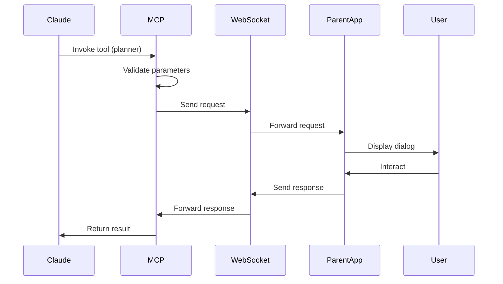

# MCP Architecture Deep Dive

## Table of Contents
1. [Overview](#overview)
2. [MCP Server Architecture](#mcp-server-architecture)
3. [Tool Registration](#tool-registration)
4. [Message Flow](#message-flow)
5. [Parent App Integration](#parent-app-integration)
6. [Error Handling](#error-handling)
7. [State Management](#state-management)
8. [Development Guide](#development-guide)

## Overview

The Model Context Protocol (MCP) is the communication layer between Claude AI and the Claude Pause UI. It defines how tools are registered, invoked, and how responses are handled.

## MCP Server Architecture

### Core Components

```
┌─────────────────────────────────────────────────────────┐
│                    MCP Server (Claude)                    │
├─────────────────────────────────────────────────────────┤
│  Tool Registry                                           │
│  ├── planner                                            │
│  ├── text_input                                         │
│  ├── single_choice                                      │
│  ├── multi_choice                                       │
│  ├── screenshot_request                                 │
│  └── confirm                                            │
├─────────────────────────────────────────────────────────┤
│  Protocol Handler                                        │
│  ├── Request Parser                                     │
│  ├── Response Builder                                   │
│  └── Error Handler                                      │
├─────────────────────────────────────────────────────────┤
│  WebSocket Manager                                       │
│  ├── Connection Pool                                    │
│  ├── Message Queue                                      │
│  └── Heartbeat Monitor                                  │
└─────────────────────────────────────────────────────────┘
```

### Tool Registration

Each MCP tool follows this structure:

```typescript
interface MCPTool {
  name: string;
  description: string;
  parameters: {
    type: 'object';
    properties: Record<string, ParameterDefinition>;
    required?: string[];
  };
  handler: (params: any) => Promise<any>;
}
```

Example tool registration:

```typescript
// Planner tool registration
mcp.registerTool({
  name: 'planner',
  description: 'Interactive planning dialog with visual output',
  parameters: {
    type: 'object',
    properties: {
      decision_context: {
        type: 'string',
        description: 'Context for the decision'
      },
      visual_output: {
        type: 'string',
        description: 'Markdown content for visual display'
      },
      plan: {
        type: 'string',
        description: 'Implementation plan'
      },
      options: {
        type: 'array',
        items: {
          type: 'object',
          properties: {
            label: { type: 'string' },
            value: { type: 'string' },
            description: { type: 'string' }
          }
        }
      }
    },
    required: ['decision_context', 'options']
  },
  handler: async (params) => {
    // Send to parent app via WebSocket
    return await sendToParentApp('planner', params);
  }
});
```

## Message Flow

### 1. Tool Invocation Flow



### 2. Request Message Structure

```json
{
  "jsonrpc": "2.0",
  "id": "req_abc123",
  "method": "tools/call",
  "params": {
    "name": "planner",
    "arguments": {
      "decision_context": "We need to implement a new feature",
      "visual_output": "## Feature Details\n- Feature A\n- Feature B",
      "plan": "1. Design API\n2. Implement frontend\n3. Add tests",
      "options": [
        {
          "label": "Start with API",
          "value": "api_first",
          "description": "Design and implement the API first"
        },
        {
          "label": "Start with UI",
          "value": "ui_first",
          "description": "Create the UI mockup first"
        }
      ]
    }
  }
}
```

### 3. Response Message Structure

```json
{
  "jsonrpc": "2.0",
  "id": "req_abc123",
  "result": {
    "choice": "api_first",
    "thinkingMode": "deep",
    "additionalContext": "I prefer to start with a solid API foundation",
    "attachments": [],
    "timestamp": "2025-01-25T10:00:00.000Z"
  }
}
```

### 4. Error Response Structure

```json
{
  "jsonrpc": "2.0",
  "id": "req_abc123",
  "error": {
    "code": -32603,
    "message": "User cancelled the dialog",
    "data": {
      "cancelled": true,
      "timestamp": "2025-01-25T10:00:00.000Z"
    }
  }
}
```

## Parent App Integration

### WebSocket Server (Parent App Side)

```javascript
// src/main/index.js - WebSocket server setup
const WebSocketServer = require('ws').Server;

class MCPWebSocketServer {
  constructor(port = 3000) {
    this.wss = new WebSocketServer({ port });
    this.activeConnections = new Map();
    this.pendingRequests = new Map();
    
    this.setupServer();
  }

  setupServer() {
    this.wss.on('connection', (ws, req) => {
      const connectionId = this.generateConnectionId();
      this.activeConnections.set(connectionId, ws);
      
      console.log(`MCP connection established: ${connectionId}`);
      
      ws.on('message', (data) => {
        this.handleMessage(connectionId, data);
      });
      
      ws.on('close', () => {
        this.handleDisconnect(connectionId);
      });
      
      ws.on('error', (error) => {
        this.handleError(connectionId, error);
      });
      
      // Send connection acknowledgment
      this.sendMessage(connectionId, {
        type: 'connection',
        status: 'connected',
        connectionId
      });
    });
  }

  handleMessage(connectionId, data) {
    try {
      const message = JSON.parse(data.toString());
      
      switch (message.method) {
        case 'tools/call':
          this.handleToolCall(connectionId, message);
          break;
        case 'ping':
          this.handlePing(connectionId, message);
          break;
        default:
          this.sendError(connectionId, message.id, -32601, 'Method not found');
      }
    } catch (error) {
      console.error('Failed to parse message:', error);
      this.sendError(connectionId, null, -32700, 'Parse error');
    }
  }

  handleToolCall(connectionId, message) {
    const { id, params } = message;
    const { name: tool, arguments: parameters } = params;
    
    // Store pending request
    this.pendingRequests.set(id, {
      connectionId,
      tool,
      timestamp: Date.now()
    });
    
    // Forward to Electron renderer
    if (mainWindow) {
      mainWindow.webContents.send('dialog-request', {
        requestId: id,
        dialogType: this.mapToolToDialogType(tool),
        parameters,
        timestamp: new Date().toISOString()
      });
    } else {
      this.sendError(connectionId, id, -32603, 'Application not ready');
    }
  }

  handleResponse(requestId, response) {
    const pendingRequest = this.pendingRequests.get(requestId);
    
    if (!pendingRequest) {
      console.error(`No pending request found for ${requestId}`);
      return;
    }
    
    const { connectionId } = pendingRequest;
    const ws = this.activeConnections.get(connectionId);
    
    if (ws && ws.readyState === WebSocket.OPEN) {
      if (response.cancelled) {
        this.sendError(connectionId, requestId, -32603, 'User cancelled', response);
      } else {
        this.sendResult(connectionId, requestId, response);
      }
    }
    
    // Clean up
    this.pendingRequests.delete(requestId);
  }

  mapToolToDialogType(tool) {
    const mapping = {
      'planner': 'planner',
      'text_input': 'text_input',
      'single_choice': 'single_choice',
      'multi_choice': 'multi_choice',
      'screenshot_request': 'screenshot_request',
      'confirm': 'confirm'
    };
    
    return mapping[tool] || tool;
  }

  sendMessage(connectionId, message) {
    const ws = this.activeConnections.get(connectionId);
    if (ws && ws.readyState === WebSocket.OPEN) {
      ws.send(JSON.stringify(message));
    }
  }

  sendResult(connectionId, id, result) {
    this.sendMessage(connectionId, {
      jsonrpc: '2.0',
      id,
      result
    });
  }

  sendError(connectionId, id, code, message, data = null) {
    this.sendMessage(connectionId, {
      jsonrpc: '2.0',
      id,
      error: {
        code,
        message,
        data
      }
    });
  }
}
```

### IPC Communication Layer

```javascript
// Main process IPC handlers
const { ipcMain } = require('electron');

// Handle responses from renderer
ipcMain.handle('dialog-response', async (event, response) => {
  const { requestId, data } = response;
  
  // Validate response
  if (!requestId || !data) {
    throw new Error('Invalid response format');
  }
  
  // Forward to WebSocket server
  if (mcpServer) {
    mcpServer.handleResponse(requestId, data);
  }
  
  return { success: true };
});

// Handle other MCP-related IPC calls
ipcMain.handle('mcp-status', async () => {
  return {
    connected: mcpServer?.isConnected() || false,
    activeDialogs: mcpServer?.getActiveDialogCount() || 0,
    uptime: process.uptime()
  };
});
```

## Error Handling

### Error Categories

1. **Connection Errors**
   - WebSocket disconnection
   - Network timeouts
   - Invalid connection state

2. **Protocol Errors**
   - Invalid message format
   - Missing required fields
   - Unknown methods

3. **Application Errors**
   - Dialog rendering failures
   - State corruption
   - Memory issues

4. **User Errors**
   - Dialog cancellation
   - Invalid input
   - Timeout

### Error Recovery Strategies

```javascript
class ErrorRecovery {
  constructor() {
    this.retryAttempts = new Map();
    this.maxRetries = 3;
    this.retryDelay = 1000;
  }

  async handleError(error, context) {
    const errorType = this.classifyError(error);
    
    switch (errorType) {
      case 'CONNECTION':
        return this.handleConnectionError(error, context);
      case 'PROTOCOL':
        return this.handleProtocolError(error, context);
      case 'APPLICATION':
        return this.handleApplicationError(error, context);
      case 'USER':
        return this.handleUserError(error, context);
      default:
        return this.handleUnknownError(error, context);
    }
  }

  async handleConnectionError(error, context) {
    const { requestId } = context;
    const attempts = this.retryAttempts.get(requestId) || 0;
    
    if (attempts < this.maxRetries) {
      this.retryAttempts.set(requestId, attempts + 1);
      
      // Exponential backoff
      const delay = this.retryDelay * Math.pow(2, attempts);
      await this.delay(delay);
      
      // Retry the request
      return this.retryRequest(context);
    } else {
      // Max retries reached
      this.cleanup(requestId);
      throw new Error('Max retries exceeded');
    }
  }

  classifyError(error) {
    if (error.code === 'ECONNREFUSED' || error.code === 'ETIMEDOUT') {
      return 'CONNECTION';
    }
    if (error.message.includes('parse') || error.message.includes('invalid')) {
      return 'PROTOCOL';
    }
    if (error.message.includes('render') || error.message.includes('component')) {
      return 'APPLICATION';
    }
    if (error.cancelled || error.message.includes('cancelled')) {
      return 'USER';
    }
    return 'UNKNOWN';
  }
}
```

## State Management

### Dialog State Machine

```typescript
enum DialogState {
  IDLE = 'IDLE',
  PENDING = 'PENDING',
  ACTIVE = 'ACTIVE',
  RESPONDING = 'RESPONDING',
  COMPLETED = 'COMPLETED',
  ERROR = 'ERROR',
  CANCELLED = 'CANCELLED'
}

class DialogStateMachine {
  private state: DialogState = DialogState.IDLE;
  private transitions: Map<string, DialogState> = new Map();
  
  constructor() {
    this.setupTransitions();
  }
  
  setupTransitions() {
    // Define valid state transitions
    this.addTransition(DialogState.IDLE, 'REQUEST', DialogState.PENDING);
    this.addTransition(DialogState.PENDING, 'DISPLAY', DialogState.ACTIVE);
    this.addTransition(DialogState.ACTIVE, 'SUBMIT', DialogState.RESPONDING);
    this.addTransition(DialogState.ACTIVE, 'CANCEL', DialogState.CANCELLED);
    this.addTransition(DialogState.RESPONDING, 'SUCCESS', DialogState.COMPLETED);
    this.addTransition(DialogState.RESPONDING, 'ERROR', DialogState.ERROR);
  }
  
  transition(event: string): boolean {
    const key = `${this.state}-${event}`;
    const nextState = this.transitions.get(key);
    
    if (nextState) {
      this.state = nextState;
      this.onStateChange(nextState);
      return true;
    }
    
    console.warn(`Invalid transition: ${key}`);
    return false;
  }
  
  onStateChange(newState: DialogState) {
    // Emit state change events
    eventEmitter.emit('dialog-state-change', {
      state: newState,
      timestamp: Date.now()
    });
  }
}
```

### Request Tracking

```typescript
interface RequestMetadata {
  id: string;
  tool: string;
  parameters: any;
  state: DialogState;
  createdAt: number;
  updatedAt: number;
  attempts: number;
  error?: Error;
  response?: any;
}

class RequestTracker {
  private requests: Map<string, RequestMetadata> = new Map();
  private history: RequestMetadata[] = [];
  private maxHistorySize = 1000;
  
  track(request: Partial<RequestMetadata>): string {
    const id = request.id || this.generateId();
    const metadata: RequestMetadata = {
      id,
      tool: request.tool!,
      parameters: request.parameters,
      state: DialogState.PENDING,
      createdAt: Date.now(),
      updatedAt: Date.now(),
      attempts: 0,
      ...request
    };
    
    this.requests.set(id, metadata);
    return id;
  }
  
  update(id: string, updates: Partial<RequestMetadata>) {
    const metadata = this.requests.get(id);
    if (metadata) {
      Object.assign(metadata, updates, {
        updatedAt: Date.now()
      });
    }
  }
  
  complete(id: string, response: any) {
    const metadata = this.requests.get(id);
    if (metadata) {
      metadata.state = DialogState.COMPLETED;
      metadata.response = response;
      metadata.updatedAt = Date.now();
      
      // Move to history
      this.history.push(metadata);
      this.requests.delete(id);
      
      // Trim history if needed
      if (this.history.length > this.maxHistorySize) {
        this.history = this.history.slice(-this.maxHistorySize);
      }
    }
  }
  
  getActiveRequests(): RequestMetadata[] {
    return Array.from(this.requests.values());
  }
  
  getMetrics() {
    const active = this.getActiveRequests();
    const completed = this.history.filter(r => r.state === DialogState.COMPLETED);
    const errors = this.history.filter(r => r.state === DialogState.ERROR);
    const cancelled = this.history.filter(r => r.state === DialogState.CANCELLED);
    
    return {
      active: active.length,
      completed: completed.length,
      errors: errors.length,
      cancelled: cancelled.length,
      averageResponseTime: this.calculateAverageResponseTime(completed),
      successRate: completed.length / (completed.length + errors.length + cancelled.length)
    };
  }
}
```

## Development Guide

### Adding a New Tool

1. **Define the tool interface**:
```typescript
// In MCP server
interface MyNewTool {
  name: 'my_new_tool';
  parameters: {
    question: string;
    options?: string[];
  };
  response: {
    answer: string;
    confidence: number;
  };
}
```

2. **Register with MCP**:
```typescript
mcp.registerTool({
  name: 'my_new_tool',
  description: 'Description of what the tool does',
  parameters: {
    type: 'object',
    properties: {
      question: {
        type: 'string',
        description: 'The question to ask'
      },
      options: {
        type: 'array',
        items: { type: 'string' },
        description: 'Optional list of choices'
      }
    },
    required: ['question']
  },
  handler: async (params) => {
    return await sendToParentApp('my_new_tool', params);
  }
});
```

3. **Update parent app mapping**:
```javascript
// In WebSocket server
mapToolToDialogType(tool) {
  const mapping = {
    // ... existing mappings
    'my_new_tool': 'my_new_dialog'
  };
  return mapping[tool] || tool;
}
```

4. **Create dialog component**:
```typescript
// In renderer process
export function MyNewDialog({ requestId, parameters }: Props) {
  // Implementation
}
```

### Testing MCP Integration

1. **Unit Tests**:
```typescript
describe('MCP Tool Registration', () => {
  it('should register tool correctly', () => {
    const tool = {
      name: 'test_tool',
      parameters: { /* ... */ },
      handler: jest.fn()
    };
    
    mcp.registerTool(tool);
    expect(mcp.getTool('test_tool')).toBeDefined();
  });
});
```

2. **Integration Tests**:
```typescript
describe('MCP WebSocket Communication', () => {
  let server: MCPWebSocketServer;
  let client: WebSocket;
  
  beforeEach(() => {
    server = new MCPWebSocketServer(3001);
    client = new WebSocket('ws://localhost:3001');
  });
  
  it('should handle tool calls', (done) => {
    client.on('open', () => {
      client.send(JSON.stringify({
        jsonrpc: '2.0',
        id: 'test-1',
        method: 'tools/call',
        params: {
          name: 'planner',
          arguments: { /* ... */ }
        }
      }));
    });
    
    client.on('message', (data) => {
      const response = JSON.parse(data.toString());
      expect(response.id).toBe('test-1');
      done();
    });
  });
});
```

### Debugging MCP Communication

1. **Enable verbose logging**:
```javascript
// Set environment variable
process.env.MCP_DEBUG = 'true';

// In WebSocket server
if (process.env.MCP_DEBUG) {
  console.log('[MCP]', 'Message received:', message);
}
```

2. **Use Chrome DevTools**:
- Open DevTools in Electron
- Go to Network tab
- Filter by WS (WebSocket)
- Click on the WebSocket connection
- View Messages tab for real-time communication

3. **MCP Inspector Tool**:
```javascript
// Development-only tool for inspecting MCP messages
class MCPInspector {
  constructor() {
    this.messages = [];
    this.filters = new Set();
  }
  
  intercept(message, direction) {
    const entry = {
      timestamp: Date.now(),
      direction, // 'incoming' or 'outgoing'
      message,
      size: JSON.stringify(message).length
    };
    
    this.messages.push(entry);
    this.notify(entry);
  }
  
  filter(toolName) {
    this.filters.add(toolName);
  }
  
  getFiltered() {
    if (this.filters.size === 0) return this.messages;
    
    return this.messages.filter(entry => {
      const tool = entry.message.params?.name;
      return this.filters.has(tool);
    });
  }
  
  export() {
    const data = {
      session: {
        start: this.messages[0]?.timestamp,
        end: this.messages[this.messages.length - 1]?.timestamp,
        messageCount: this.messages.length
      },
      messages: this.messages
    };
    
    fs.writeFileSync('mcp-debug.json', JSON.stringify(data, null, 2));
  }
}
```

## Performance Considerations

### Message Size Optimization

```javascript
class MessageOptimizer {
  compress(message) {
    // Remove null/undefined values
    const cleaned = this.removeNulls(message);
    
    // Compress large text fields
    if (cleaned.params?.visual_output) {
      cleaned.params.visual_output = this.compressText(cleaned.params.visual_output);
    }
    
    return cleaned;
  }
  
  removeNulls(obj) {
    return JSON.parse(JSON.stringify(obj, (key, value) => 
      value === null || value === undefined ? undefined : value
    ));
  }
  
  compressText(text) {
    // Simple compression for repeated patterns
    if (text.length > 1000) {
      return {
        compressed: true,
        data: zlib.gzipSync(text).toString('base64')
      };
    }
    return text;
  }
}
```

### Connection Pooling

```javascript
class ConnectionPool {
  constructor(maxConnections = 10) {
    this.connections = new Map();
    this.maxConnections = maxConnections;
    this.waitQueue = [];
  }
  
  async acquire() {
    if (this.connections.size < this.maxConnections) {
      const conn = await this.createConnection();
      this.connections.set(conn.id, conn);
      return conn;
    }
    
    // Wait for available connection
    return new Promise((resolve) => {
      this.waitQueue.push(resolve);
    });
  }
  
  release(connId) {
    const conn = this.connections.get(connId);
    if (conn) {
      if (this.waitQueue.length > 0) {
        const waiter = this.waitQueue.shift();
        waiter(conn);
      } else {
        conn.lastUsed = Date.now();
      }
    }
  }
  
  cleanup() {
    const now = Date.now();
    const timeout = 5 * 60 * 1000; // 5 minutes
    
    for (const [id, conn] of this.connections) {
      if (now - conn.lastUsed > timeout) {
        conn.close();
        this.connections.delete(id);
      }
    }
  }
}
```

## Security Best Practices

1. **Input Validation**:
```javascript
const validator = {
  validateToolCall(params) {
    // Whitelist allowed tools
    const allowedTools = ['planner', 'text_input', /* ... */];
    if (!allowedTools.includes(params.name)) {
      throw new Error('Invalid tool name');
    }
    
    // Validate parameters
    this.validateParameters(params.name, params.arguments);
  },
  
  validateParameters(tool, params) {
    // Tool-specific validation
    switch (tool) {
      case 'planner':
        if (!params.decision_context || typeof params.decision_context !== 'string') {
          throw new Error('Invalid decision_context');
        }
        if (!Array.isArray(params.options)) {
          throw new Error('Options must be an array');
        }
        break;
      // ... other tools
    }
  }
};
```

2. **Rate Limiting**:
```javascript
class RateLimiter {
  constructor(maxRequests = 100, windowMs = 60000) {
    this.requests = new Map();
    this.maxRequests = maxRequests;
    this.windowMs = windowMs;
  }
  
  check(clientId) {
    const now = Date.now();
    const clientRequests = this.requests.get(clientId) || [];
    
    // Remove old requests
    const validRequests = clientRequests.filter(
      time => now - time < this.windowMs
    );
    
    if (validRequests.length >= this.maxRequests) {
      throw new Error('Rate limit exceeded');
    }
    
    validRequests.push(now);
    this.requests.set(clientId, validRequests);
  }
}
```

## Monitoring and Metrics

```javascript
class MCPMetrics {
  constructor() {
    this.metrics = {
      requests: new Map(),
      responses: new Map(),
      errors: new Map(),
      latency: []
    };
  }
  
  recordRequest(tool) {
    const count = this.metrics.requests.get(tool) || 0;
    this.metrics.requests.set(tool, count + 1);
  }
  
  recordResponse(tool, duration) {
    const count = this.metrics.responses.get(tool) || 0;
    this.metrics.responses.set(tool, count + 1);
    
    this.metrics.latency.push({
      tool,
      duration,
      timestamp: Date.now()
    });
  }
  
  recordError(tool, error) {
    const errors = this.metrics.errors.get(tool) || [];
    errors.push({
      error: error.message,
      timestamp: Date.now()
    });
    this.metrics.errors.set(tool, errors);
  }
  
  getReport() {
    const tools = Array.from(this.metrics.requests.keys());
    
    return tools.map(tool => ({
      tool,
      requests: this.metrics.requests.get(tool) || 0,
      responses: this.metrics.responses.get(tool) || 0,
      errors: (this.metrics.errors.get(tool) || []).length,
      averageLatency: this.calculateAverageLatency(tool),
      successRate: this.calculateSuccessRate(tool)
    }));
  }
}
```